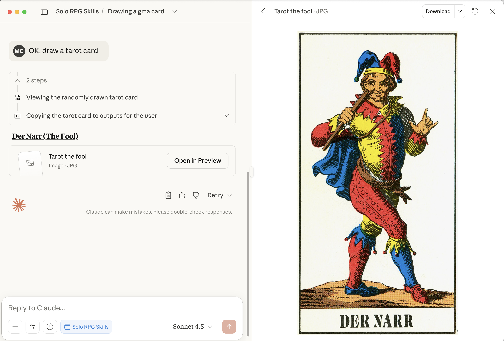
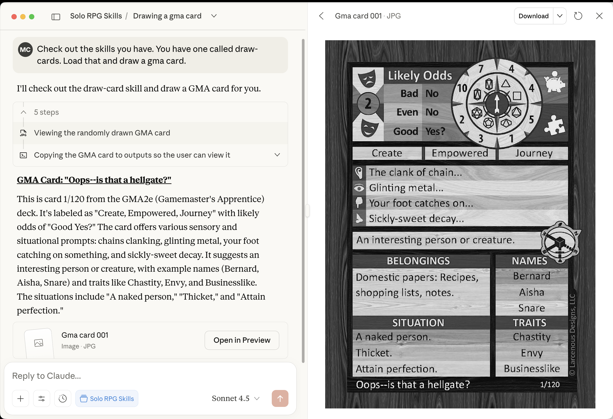

This is a [Claude Agent Skill](https://docs.claude.com/en/docs/claude-code/skills) that draws random cards and displays them. I made it to help with solo roleplaying to use things like the [Game Master's Apprentice deck](https://www.drivethrurpg.com/en/product/125685/the-gamemaster-s-apprentice-base-deck) (GMA).

To use it, run the `package-skill.sh` scipt. This create a Claude Skill zip file in the build directory called `draw-card-v-1.0.zip`.

The skill includes a sub-set of [the public domain Swiss Tarot set](https://en.wikipedia.org/wiki/Swiss_Tarot). 

## Usage

You can tell Claude things like `draw a card from the tarot deck` or `draw three cards from the GMA deck`. Here are some example responses:





## Adding new card decks

To add other cards, create a sub-directory in `src` with the name you would like and copy the image files there. You can include a README.md file to describe how to use the cards. These do not need to be "cards," of course, and can be any image. You could put in random maps, inspirational pictures, etc.

### GMA Example

For example, I take the VTT images including the [Game Master's Apprentice deck](https://www.drivethrurpg.com/en/product/125685/the-gamemaster-s-apprentice-base-deck) package and put them in `src/gma` along with the following README.md:

```
# GameMaster's Apprentice (GMA), second edition (2e) Card Overview

## How to use and display

This deck of cards is the Game Master's Apprentice deck. Sometimes called "GMA" or "GameMaster's Apprentice." By default, only show the card (provide a link to it for the user), do not read it and interpreting it. IF AND ONLY IF the user also asks you to read the card, read the card and tell them what is on it, and provide a brief interpretation for the current context, story, etc. Always show the card and/or provide a link to view it per the general draw-cards skill description. Remember: UNLESS ASKED TO READ AND INTERPRET THE CARD, YOU WILL ONLY DISPLAY THE CARD.

## Explanation of card sections

**Purpose:** 120-card oracle deck for solo RPG play and GM assistance. Each card contains 14+ randomizers.

**Card Elements:**
1. **Difficulty Generator** - Bell-curved 1-10 (most results 4-7)
2. **Likely Odds** - Yes/No oracle with 6 outcomes: YES!/Yes/Yes?/No?/No/NO! (Bad=25% yes, Even=50%, Good=75%)
3. **Dice Wheel** - d4, d6, d8, d10, d12, d20, d00, d10, scatter die (8 directions + hit/miss)
4. **Prompt Icons** - Two images per card for free interpretation
5. **Random Event Generator** - Verb/Adjective/Noun combination (1.7M+ combos if drawing separately)
6. **Sensory Snippets** - Hear/See/Feel/Smell descriptors
7. **Map Icon** - Pathways in 6 directions (solid=clear, short=dead end, dotted=hidden, barred=obstacle)
8. **Names** - Three names (typically fem/masc/neutral or genre-specific)
9. **Traits** - Virtue/Vice/Unique Characteristic (draw separately for true randomness)
10. **Card Number** - 1-120 identifier
11. **Flavor Text** - Varies by deck version
12. **Situation** - Catalyst (inciting incident) / Location / Stakes (what's at risk)
13. **Belongings** - Category + 3 examples
14. **Scene Types** - Quick encounter ideas

**Primary Uses:**
- **Yes/No Questions:** Draw for Likely Odds (choose Bad/Even/Good based on likelihood)
- **NPC Creation:** Traits (1 card each) + Belongings + Name + optional Stakes/Sensory details
- **Random Events:** Draw Verb, then Noun; add Adjective if needed. Interpret in context.
- **Story Seeds:** Use full Situation (Catalyst/Location/Stakes) + Sensory Snippets + NPC details
- **Solo Play:** Ask leading questions, draw for answers. Use Difficulty as "tension" - if result < tension number, random event occurs

**Interpretation Philosophy:** Cards provide direction; you supply context and details. Redraw or reinterpret if results don't fit genre/tone. "Fair" means maintaining fun, not rigid adherence.

For more, purchase and download [the Game Master's Apprentice deck](https://www.drivethrurpg.com/en/product/125685/the-gamemaster-s-apprentice-base-deck).
```

Unfortunitly, Claude still interprets the cards, using up precious tokens. But, it's still cool!

## Author

ChatGPT and Claude were used to write parts of this project at various stages.

See more of my solo roleplaying stuff in the ChatDM projects.

-[Coté](https://cote.io)